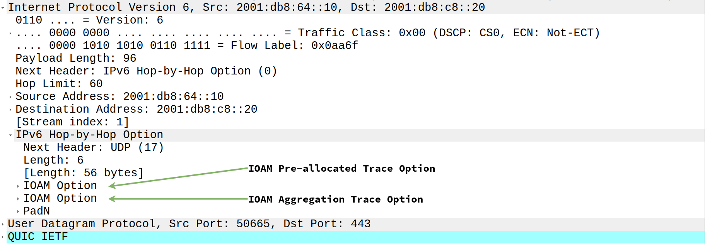
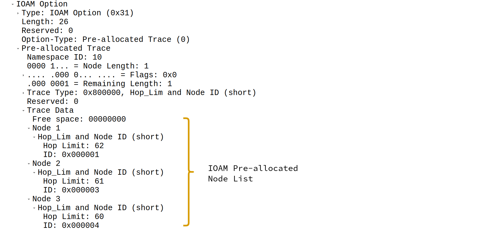
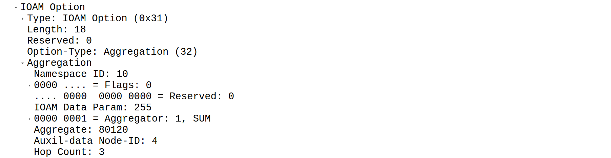

# green-path-optimizer [@OST](https://www.ost.ch/en/)

Is an application framework for simulating a proof-of-concept environment that demonstrates an approach to gaining transparency on the environmental costs of network paths and optimising the flow of data within that network to reduce the carbon footprint caused by its operation.

**Currently** it contains the following components: 

- **Network** based on BMv2 software switches capable of:
  - Collecting inband network telemetry (INT) data regarding energy efficiency of network paths using the IOAM protocol
  - Exporting the INT data using IPFIX
- **Configuration** utilities capable of:
  - Provisioning of an arbitrary network topology with information out of a declarative YAML definition
  - Dynamic configuration update of network paths and network efficiency which uses the [nornir](https://github.com/nornir-automation/nornir) network automation framework
- **Monitoring** system based on the Telegraf, InfluxDB, Grafana (TIG) Stack capable of:
  - Collection  of IPFIX messages ([Telegraf](https://www.influxdata.com/time-series-platform/telegraf/))
  - Parsing of IOAM raw export IPFIX messages ([Telegraf](https://www.influxdata.com/time-series-platform/telegraf/))
  - Persistent storage of efficiency data ([InfluxDB](https://www.influxdata.com/))
  - Visualization of efficiency data ([Grafana](https://grafana.com/))

**In near futre** it will also contain the following components:

- **Optimizer** to be developed at [RIPE NCC Green Tech Hackathon](https://labs.ripe.net/author/becha/announcing-the-green-tech-hackathon/) which is capable of:
  - Analyzing the given time series data stored in InfluxDB
  - Proposing configuration changes to route traffic over the most efficient paths between every possible ingress and egress router
  - Trigger configuration update to actually implement the proposed optimization in the network.
- **Validator** which is to be developed after the hackathon and validates the optimiser's configuration changes to e.g. prevent data from being sent through bottlenecks or certain paths from being overprovisioned.

## Introduction

Over the past year, my colleagues and I (Ramon) have delved into the field of sustainable networking, focusing on the critical challenge of improving energy efficiency in computer networks.
Our initial research revealed a significant gap: **optimizing network energy efficiency through traffic engineering methods is extremely difficult due to the lack of visibility into the energy efficiency of network paths.**

This realization led us to focus on enhancing visibility into the energy efficiency of network paths and nodes.
After several months of research, we published a paper titled *"Towards Sustainable Networking: Unveiling Energy Efficiency Through Hop and Path Efficiency Indicators in Computer Networks"*, which was presented at IEEE Netsoft 2024 and is now available on [IEEE Xplore](https://ieeexplore.ieee.org/document/10588907).

Our proof-of-concept (PoC) implementation already includes several key capabilities:
- The collection of network telemetry data embedded in packet metadata using the [IOAM Aggregation Trace Option](https://datatracker.ietf.org/doc/html/draft-cxx-ippm-ioamaggr-02)
- Standardized export of the collected network telemetry data to an [IPFIX](https://www.rfc-editor.org/rfc/rfc7011) collector
- Visualization of the collected data on descriptive Grafana dashboards

While this provides a strong foundation, our next goal is to act on the collected data by proposing actual improvements to network configuration. This includes the development of the *green-path-optimizer* application and running simulations across different topologies to verify the applicability in various use cases.

### Overview

The figure below illustrates our proof of concept in a simplified network environment.

- When packets travel through the network an efficiency rating will be attached to it on the ingress node.
- On each subsequent node this energy rating is updated using an aggregation function such as *SUM, MIN or MAX*.
Additionally each node adds himself to the node list to trace the path the packet traversed.
- As a result the packet will contain the path efficiency rating as well as the path taken inside its metadata which is then exported via IPFIX.

On the Monitoring side there is a **Telegraf, Influx, Grafana (TIG) Stack** which collects, stores and displays the collected data.

#### Efficiency Indication

Efficiency indication is a critical aspect of this project.
The following efficiency indicators were introduced:

- **Hop Efficiency Indicator (HEI):** Is an arbitrary number indicating the efficiency of a hop. There can be several HEI values at the same time, which cover different aspects of a hop's energy efficiency.
- **Link Efficiency Indicator (LEI):** Is a dedicated value to indicate the efficiency of an interface.
For example a 10GBit/s copper interface via a twisted pair cable could be indicated to be less expensive in the means of energy efficiency compared to an interface connected to a 10GBit/s long-haul fiber connection.
- **Hop Traversal Cost (HTC):** Is the result of accumulating the LEI of the ingress link, the HEI and the LEI of the egress link.
- **Path Efficiency Indicator (PEI):** Is the accumulation of HTC values in case the SUM aggregator is used. It indicates the efficiency of the path the packet traversed.
- **Flow Efficiency Indicator (FEI):** Is depending on the aggregator used the average PEI (SUM aggregator), the minimum HEI (MIN aggregator) or maximum HEI (MAX aggregator) considering the network telemetry data of all packets corresponding to the specific flow.

##### Challenges

Some of the identfied challenges are:

1. Collection and processing of inband network telemetry data at line rate
1. Increased packet size as a result of inband network telemetry
1. Aggregation of collected data within the network so that the data is ready to act on and no further computation is requried to obtain the path metric
1. Mapping of energy metrics to comparable values
1. Flexibility in regards to environmental factors 
1. Knowledge about the path a specific path metric belongs to

The challenges where adressed as follows:

1. To ensure data can be processed at line rate the efficiency data is collected outside of the data plane. It is supposed to be exposed to the data plane via a lookup table comparable to the tables of the forwarding information base (FIB). Additionally the aggregation which happens inside the data plane avoids using complex arithmetical operations.
1. The mitigation of the increased packet size due to INT goes hand in hand with the challenge/requirement to aggregate the data in transit which reduces the volume of network telemetry data present in packet headers.
1. To aggregate the efficiency data in transit the [IOAM Aggregation Trace Option](https://datatracker.ietf.org/doc/html/draft-cxx-ippm-ioamaggr-02) is used.
1. As shown in figure (todo reference) one or more energy metrics are mapped to a hop metric. With a consistent energy metric to hop metric configuration on all nodes the hop metrics of the same type will be comparable.
1. The energy metric mapping as shown in figure (todo reference) can be setup as required but needs to be consistent throughout the same IOAM domain. In case energy metrics shall also be exchanged between autonomous systems (AS) with e.g. BGP in future some common configurations need to be standardized.
1. To determine to which path a specific path metric belongs the [Pre-allocated IOAM Trace Option](https://datatracker.ietf.org/doc/html/rfc9197) is used in combination with the [IOAM Aggregation Trace Option](https://datatracker.ietf.org/doc/html/draft-cxx-ippm-ioamaggr-02).

##### Proposed Solution

The proposed solution depicted in the figure below  works as follows:
1. Maps one or more energy metrics to a hop metric.
This process is carried out periodically on each node outside of its data plane.
1. The determined hop metrics are then stored in lookup tables accessible by the data plane similar to the FIB.
1. The data plane then continously reads the hop metrics from the lookup tables during the forwarding operation of IP packets.
    1. In case of an **ingress node:** Relevant header fields are added and initialized with the **hop metric** retrieved from the lookup tables.
    1. In case of a **transit node:** The header fields are updated/aggregated with the **hop metric** retrieved from the lookup tables.
    1. In case of an **egress node:** Same as on the transit node. Additionally the relevant header fields representing the **path metric** are exported to a collector using IPFIX.

Notice that the energy metrics and the mappings chosen in the figure below are examples only.

#### Network Telemetry (IOAM)

To store the efficiency data as inband network telemetry data the IOAM protocol is used.
The following sections show how the telemetry data is included in an IPv6 packet.

##### IPv6 Hop-by-Hop Option Extension Header

An ingress node pushes a Hop-by-Hop extension header and initializes the IOAM option header fields contained.

An IPv6 packet carrying network telemetry data looks as shown in the packet capture below. 

##### IOAM Pre-allocated Trace Option

The first IOAM Option carried inside the Hop-by-Hop Option extension header is used to trace the path the packet traversed.

Besides other fields it contains a list of nodes in the order traversed with the corresponding node id and hop limit on that specific node.

In the figure below:

- The packet traversed the nodes 1-2-4
- The node list has free space to trace one more node

Refer to [RFC9197](https://datatracker.ietf.org/doc/html/rfc9197) for more information about individual header fields.

##### IOAM Aggregation Option

The second IOAM Option carried inside the Hop-by-Hop Option extension header is used to store the aggregated energy efficiency data of all nodes on the path.

In the figure below:
 - The HEI with ID *255* is being collected
 - The *SUM* aggregator is used
 - The PEI is *70120*

Refer to [draft-cxx-ippm-ioamaggr-02](https://datatracker.ietf.org/doc/html/draft-cxx-ippm-ioamaggr-02) for more information about individual header fields.

#### Export Mechanism (IPFIX)

On egress routers the collected path metrics stored inside the IPv6 packet as network telemetry data is exported with IPFIX as standardized in [RFC7011](https://www.rfc-editor.org/rfc/rfc7011).
As already stated earlier the BMv2 software switches are used in the PoC network environment.
By default the BMv2 switches are not capable of exporting data via IPFIX.
A fork with the corresponding IPFIX implementation is available [here](https://github.com/ramobis/behavioral-model).
The implementation can be found in the `externs` directory.

There are two different export mechanisms which fulfill different needs.

##### Aggregated Export

The aggregated export is used to make **flow statistics** available to a network operator emphasizing the capability of the generation of a heat map containing endpoint to endpoint network efficiency information.

As part of the aggregated export data is grouped by flow and IOAM aggregator.
The network telemetry data of all packets within the same group is then aggregated using the IOAM aggregator specified and exported within a single IPFIX message.

##### Raw Export

The raw export is used to make **path statistics** available to a network operator emphasizing the identification possibilities of inefficient paths and nodes within a network.

With this export mechanism the complete IPv6 header including all extension headers is exported.
That means that not only the efficiency metric is going to be available but also the corresponding path information the metric belongs to.

The raw export is implemented in such a way that it always exports the first packet of a flow and then every nth packet based on the configured sampling rate per flow.

#### Dashboard

### Related Work

- **IEEE Publication:** [Towards Sustainable Networking: Unveiling Energy Efficiency Through Hop and Path Efficiency Indicators in Computer Networks](https://ieeexplore.ieee.org/document/10588907)
- **Internet - Draft:** [Aggregation Trace Option for In-situ Operations, Administration, and Maintenance IOAM](https://datatracker.ietf.org/doc/html/draft-cxx-ippm-ioamaggr-02)
- **Internet - Draft:** [Challenges and Opportunities in Management for Green Networking](https://datatracker.ietf.org/doc/draft-irtf-nmrg-green-ps/03/)
- **RFC - Proposed Standard:** [Data Fields for In Situ Operations, Administration, and Maintenance (IOAM)](https://datatracker.ietf.org/doc/html/rfc9197)

## Project Objectives During the Hackathon

The primary goal is to demonstrate that energy-efficient traffic routing can be achieved using our collected data, while also identifying any gaps in the current dataset that would be crucial for further optimizations.

This includes the following work items:

- Analysis of given raw data in InfluxDB  
- **Development of green-path-optimizer application which suggests path updates to improve efficiency**
- **Integration of the configuration-update-utility to acutally deploy the improvements in the PoC network environment**
- In case there is time:
  - Parameter evaluation
  - Interpretation of improvements and what is needed to apply it in practice
  - Validation of the suggested improvements also regarding throughput / bottlenecks etc.
  - **Conception of efficiency discovery mechanism of all paths of a given length in an arbitrary topology.**
