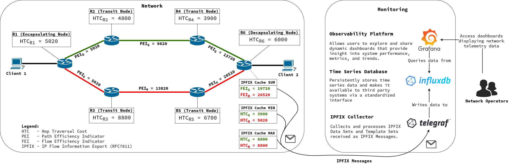

# green-path-optimizer [@OST](https://www.ost.ch/en/)

## Contents

- [Introduction](#introduction)
- [Project Overview](#project-overview)
- [Project Objectives During Hackathon](#project-objectives-during-hackathon)
- [Getting Started](#getting-started)
- [Related Work](#related-work)

## Introduction

The green-path-optimizer is a framework for simulating a proof-of-concept environment. It shows how to measure the environmental impact of network paths and optimize data flow to reduce the network's carbon footprint.

**Currently** it contains the following components:

- **Network** based on [BMv2](https://github.com/p4lang/behavioral-model) software switches capable of:
  - Collecting inband network telemetry (INT) data regarding energy efficiency of network paths using the [IOAM](https://datatracker.ietf.org/doc/rfc9197/) protocol
  - Exporting the INT data using [IPFIX](https://datatracker.ietf.org/doc/html/rfc7011)
- **Configuration** utilities capable of:
  - Provisioning of an arbitrary network topology with information from a declarative YAML definition
  - Dynamic configuration update of network paths and network efficiency which uses the [nornir](https://github.com/nornir-automation/nornir) network automation framework
- **Monitoring** system based on the Telegraf, InfluxDB, Grafana (TIG) Stack capable of:
  - Collection of IPFIX messages ([Telegraf](https://www.influxdata.com/time-series-platform/telegraf/))
  - Parsing of IOAM raw export IPFIX messages ([Telegraf](https://www.influxdata.com/time-series-platform/telegraf/))
  - Persistent storage of efficiency data ([InfluxDB](https://www.influxdata.com/))
  - Visualization of efficiency data ([Grafana](https://grafana.com/)). Two example graphs are:
    - [Heatmap](./assets/figures/grafana_matrix.png) showing endpoint to endpoint flow efficiency
    - [Timeseries graph](./assets/figures/grafana_path_statistics.png) showing the efficiency of paths over time

**In near future** it will also contain the following components:

- **Optimizer** to be developed at [RIPE NCC Green Tech Hackathon](https://labs.ripe.net/author/becha/announcing-the-green-tech-hackathon/) capable of:
  - Analyzing the given time series data stored in InfluxDB
  - Proposing configuration changes to route traffic over the most efficient paths between every possible ingress and egress router
  - Trigger configuration update to actually implement the proposed optimization in the network.
- **Validator** to be developed after the hackathon and validates the optimiser's configuration changes to e.g. prevent data from being sent through bottlenecks or certain paths from being overprovisioned.

## Project Overview

Over the past year, my colleagues and I (Ramon) have delved into the field of sustainable networking, focusing on the critical challenge of improving energy efficiency in computer networks.
Our initial research revealed a significant gap: **optimizing network energy efficiency through traffic engineering methods is extremely difficult due to the lack of visibility into the energy efficiency of network paths.**

This realization led us to focus on enhancing visibility into the energy efficiency of network paths and nodes.
After several months of research, we published a paper titled [Towards Sustainable Networking: Unveiling Energy Efficiency Through Hop and Path Efficiency Indicators in Computer Networks](https://ieeexplore.ieee.org/document/10588907), presented at _IEEE Netsoft 2024_.

Our proof-of-concept (PoC) implementation includes several key capabilities:

- Collection of network telemetry data embedded in packet metadata using the [IOAM Aggregation Trace Option](https://datatracker.ietf.org/doc/html/draft-cxx-ippm-ioamaggr-02)
- Standardized export of the collected network telemetry data to an [IPFIX](https://www.rfc-editor.org/rfc/rfc7011) collector
- Visualization of the collected data on descriptive Grafana dashboards

While this provides a strong foundation, our next goal is to act on the collected data by proposing actual improvements to network configuration. This includes the development of the _green-path-optimizer_ application and running simulations across different topologies to verify the applicability in various use cases.

### Proof-of-Concept Environment

The figure below illustrates our proof of concept in a simplified network environment.

- When packets travel through the network, an efficiency rating will be attached to it on the ingress node.
- On each subsequent node this energy rating is updated using an aggregation function such as _SUM, MIN or MAX_.
  Additionally each node adds himself to the node list to trace the path the packet traversed.
- As a result the packet will contain the path efficiency rating as well as the path taken inside its metadata which is then exported via IPFIX.

On the Monitoring side there is a **Telegraf, Influx, Grafana (TIG) Stack** which collects, stores and displays the collected data.



#### Efficiency Indication

Efficiency indication is a critical aspect of this project.
The following efficiency indicators were introduced:

- **Hop Efficiency Indicator (HEI):** Is an arbitrary number indicating the efficiency of a hop. There can be several HEI values at the same time, which cover different aspects of a hop's energy efficiency.
- **Link Efficiency Indicator (LEI):** Is a dedicated value to indicate the efficiency of an interface.
  For example a 10GBit/s copper interface via a twisted pair cable could be indicated to be less expensive in the means of energy efficiency compared to an interface connected to a 10GBit/s long-haul fiber connection.
- **Hop Traversal Cost (HTC):** Is the result of accumulating the LEI of the ingress link, the HEI and the LEI of the egress link.
- **Path Efficiency Indicator (PEI):** Is the accumulation of HTC values in case the SUM aggregator is used. It indicates the efficiency of the path the packet traversed.
- **Flow Efficiency Indicator (FEI):** Is depending on the aggregator used the average PEI (SUM aggregator), the minimum HEI (MIN aggregator) or maximum HEI (MAX aggregator) considering the network telemetry data of all packets corresponding to the specific flow.

##### Challenges

Some of the identified challenges are:

1. Collection and processing of inband network telemetry data at line rate
1. Increased packet size as a result of inband network telemetry
1. Aggregation of collected data within the network so that the data is ready to act on and no further computation is requried to obtain the path metric
1. Mapping of energy metrics to comparable values
1. Flexibility regarding environmental factors
1. Knowledge about the path a specific path metric belongs to

The challenges were adressed as follows:

1. To ensure data can be processed at line rate, the efficiency data is collected outside the data plane. It is supposed to be exposed to the data plane via a lookup table (similar to the forwarding information base (FIB) tables). Additionally, the aggregation which happens inside the data plane avoids using complex arithmetical operations.
1. The mitigation of the increasing packet size due to INT goes hand in hand with the challenge/requirement that data must be aggregated in transit to retrieve the path metric directly. The aggregation in transit leads to constant header size no matter how many nodes are travered.
1. To aggregate the efficiency data in transit, the [IOAM Aggregation Trace Option](https://datatracker.ietf.org/doc/html/draft-cxx-ippm-ioamaggr-02) is used.
1. As shown in the figure in section [Proposed Solution](#proposed-solution) one or more energy metrics are mapped to a hop metric. With a consistent energy metric to hop metric configuration on all nodes, the hop metrics of the same type will be comparable.
1. The energy metric mapping as shown in the figure in section [Proposed Solution](#proposed-solution) can be set up as required but needs to be consistent throughout the same IOAM domain. In case energy metrics shall also be exchanged between autonomous systems (AS) with e.g. BGP in future some common configurations need to be standardized.
1. To determine to which path a specific path metric belongs the [Pre-allocated IOAM Trace Option](https://datatracker.ietf.org/doc/html/rfc9197) is used in combination with the [IOAM Aggregation Trace Option](https://datatracker.ietf.org/doc/html/draft-cxx-ippm-ioamaggr-02).

##### Proposed Solution

The proposed solution depicted in the figure below works as follows:

1. Map one or more energy metrics to a hop metric.
   This process is carried out periodically on each node outside of its data plane.
1. Store the determined hop metrics in lookup tables accessible by the data plane (similar to the FIB).
1. The data plane continously reads these hop metrics from the lookup tables during the forwarding operation of IP packets.
   1. If **ingress node:** Add relevant header fields and initialize with the **hop metric** retrieved from the lookup tables.
   1. If **transit node:** Update/aggregate header fields with the **hop metric** retrieved from the lookup tables.
   1. If **egress node:** Same as on the transit node. Additionally, export the relevant header fields representing the **path metric** to a collector using IPFIX.

Notice that the energy metrics and the mappings chosen in the figure below are examples only.


#### Network Telemetry (IOAM)

The IOAM protocol is used to store the efficiency data as inband network telemetry data.
The following sections show how the telemetry data is included in an IPv6 packet.

##### IPv6 Hop-by-Hop Option Extension Header

An ingress node pushes a Hop-by-Hop extension header and initializes the IOAM option header fields.

The packet capture below shows an IPv6 packet carrying network telemetry data.


##### IOAM Pre-allocated Trace Option

The first IOAM Option carried inside the Hop-by-Hop Option extension header is used to trace the path the packet traversed.

Besides other fields it contains a list of nodes in the order traversed with the corresponding node id and hop limit on that specific node.

In the figure below:

- The packet traversed the nodes 1-3-4
- The node list has free space to trace one more node

Refer to [RFC9197](https://datatracker.ietf.org/doc/html/rfc9197) for more information about individual header fields.


##### IOAM Aggregation Option

The second IOAM Option carried inside the Hop-by-Hop Option extension header is used to store the aggregated energy efficiency data of all nodes on the path.

In the figure below:

- The HEI with ID _255_ is being collected
- The _SUM_ aggregator is used
- The PEI is _80120_

Refer to [draft-cxx-ippm-ioamaggr-02](https://datatracker.ietf.org/doc/html/draft-cxx-ippm-ioamaggr-02) for more information about individual header fields.


#### Export Mechanism (IPFIX)

Egress routers export the collected path metrics from the IPv6 packet as network telemetry data using IPFIX (as standardized in [RFC7011](https://www.rfc-editor.org/rfc/rfc7011)).
As already stated earlier the BMv2 software switches are used in the PoC network environment.
By default the BMv2 switches are not capable of exporting data via IPFIX.
A fork with the corresponding IPFIX implementation is available [here](https://github.com/ramobis/behavioral-model).
The implementation can be found in the `externs` directory.

There are two different export mechanisms which fulfill different needs.

##### Aggregated Export

The aggregated export is used to make **flow statistics** available to a network operator as it aggregates efficiency data stored in packets on a per flow basis.For example the data is used to generate a heat map containing endpoint to endpoint network efficiency information.

Data is grouped by flow and IOAM aggregator.
The network telemetry data of all packets within the same group is then aggregated using the IOAM aggregator specified and exported within a single IPFIX message.

##### Raw Export

The raw export is used to make **path statistics** available to a network operator. This data allows to identify inefficient paths and nodes within a network.

The Raw Export mechanism exports the entire IPv6 header including all extension headers.
That means that not only the efficiency metric is going to be available but also the corresponding path information the metric belongs to.

The implementation always exports the first packet of a flow and then every nth packet based on the configured sampling rate per flow.

#### Dashboard

The Grafana dashboards visualize the time series data present in InfluxDB. These dashboards make it easy for humans to interpret how the network as a whole, indivdual paths, indivual nodes, and individual flows perform in the context of the sustainability metrics.
It is also helpful to see how the metrics change over time.
**During the hackathon these dashboards will be very helpful to see if the optimizer application actually increases the efficiency of the network.**

##### Simulation Network Statistics

This dashboard contains general information about the simulation network such as:

- Overview about which IOAM aggregator has been used (MIN, MAX, SUM) for a percentage of packets
- Number of packets per flow distribution
- Number of packets per receiver time series
- IOAM Aggregation Option error statistics

The purpose of this dashboard is mainly the debugging of issues with the network as a whole.

##### Flow Statistics

This dashboard contains information about the efficiency of individual flows.
The data displayed in this dashboard was exported via IPFIX with the **aggregated export** mechanism.
Information contained is:

- A last 5min average time series which displays how the efficiency of flows change over time
- A heatmap to indicate the efficiency of flows between each host
- Some other time series and distributions about flow efficiencies

##### Hop Statistics

This dashboard contains information about the efficiency of individual hops.
The data displayed in this dashboard was exported via IPFIX with the **raw export** mechanism and includes only data of packets which used _MIN_ or _MAX_ aggregation.
Information contained is:

- An absolut and relative discovery about how many times a router is the most efficient or most ineffcient on a specific path
- Most efficient hop discovery per path
- Most inefficient hop discovery per path

##### Path Statistics

This dashboard contains information about the efficiency of individual paths.
The data displayed in this dashboard was exported via IPFIX with the **raw export** mechanism and includes only data of packets which used _SUM_.
Information contained is:

- A last 5min average time series which displays how the efficiency of paths changes over time
- A PEI distribution
- A mapping of which path is being used between which end hosts
- A mapping of PEI value to each discovered path
- A time series which shows how the efficiency of a specific path changes over time

This dashboard could be completed with a heat map which shows the path efficiency between hops similar to the heat map in the flow statistics dashboard.

## Project Objectives During Hackathon

### Overview

The primary objective of this hackathon project is to demonstrate the feasibility of energy-efficient traffic routing using our collected network telemetry data. In addition, the project aims to identify gaps in the current dataset that could be crucial for further optimization efforts.

### Key Work Items

#### 1. **Network Telemetry Data Analysis**

Conduct an in-depth analysis of the raw data stored in InfluxDB to address key efficiency questions, such as:

- Identifying the most inefficient hop on each path.
- Determining paths that can be disabled during off-peak traffic periods and identifying alternative routes for rerouting traffic.
- Calculating the number of redundant paths between specific ingress and egress routers.
- Evaluating how many paths traverse through a particular node.

This step involves creating queries that extract actionable insights and highlight inefficiencies in the current routing configuration.

#### 2. **Development of the Green Path Optimizer**

Design and prototype the _green-path-optimizer_ application, which provides path optimization suggestions to enhance network efficiency.

- **Type:** Standalone application
- **Input:** Current and historical path statistics
- **Core Functionality:**
  - Evaluate available paths for each ingress and egress router based on their efficiencies.
  - Identify alternative paths either continuously, upon detecting efficiency drops, or when changes in node metrics occur.
  - Identify exceptionally bad performing routers which would make sense to isolate and only operate in case the traffic demands require it.
  - Suggest path updates where alternative routes offer sustained and measurable advantages while minimizing churn.

> **Note:** The application does not need to be fully implemented for the hackathon and may include stubs to simulate functionality for demonstration purposes.

#### 3. **Integration of Configuration Update Utility**

Incorporate the configuration-update utility to apply the suggested routing improvements in the proof-of-concept (PoC) network environment. This involves:

- Updating path definitions in the YAML configuration files.
- Triggering configuration regeneration to produce updated forwarding tables for BMv2 software switches.
- Deploying the updated configurations to BMv2 switches to enact traffic rerouting.
- Validating the improvements via monitoring dashboards, where increased network efficiency should be observable after the new configurations are applied.

#### 4. **Additional Fields of Investigation (Time Permitting)**

If time allows, the following supplementary investigations may be pursued:

- Evaluating parameters that influence routing efficiency.
- Interpreting observed improvements and identifying steps required for practical implementation.
- Validating the suggested optimizations with respect to throughput, bottlenecks, and overall network performance.
- **Designing an efficiency discovery mechanism** to evaluate all paths of a given length within an arbitrary topology.

### Expected Outcomes

By the end of the hackathon, the project should:

1. Provide a proof-of-concept demonstration of energy-efficient routing.
2. Highlight areas where additional data or enhancements to the current dataset are needed.
3. Lay the groundwork for a scalable solution to optimize traffic routing with minimal energy usage.

## Getting Started

### Installation

#### Network Environment

To collaborate in the hackathon **you won't need to run the network environment on your PC.**
I will bring two devices where we can run two instances of the network environment which should be enough for our purposes.

If you would like to install it, though, you will need the following software components:

- Mininet
- P4 Compiler (p4c)
- BMv2
  - You need to compile our [fork](https://github.com/ramobis/behavioral-model) from source as we had to do a little tweak in the main source code which was not contributed upstream.
- BMv2 IPFIX Extension
  - You also need to compile it from source (located in the `externs` folder in our [fork](https://github.com/ramobis/behavioral-model).
  - Do not forget to set to correct path to the shared object file in the Makefile of this repository.

I tested the setup on Ubuntu 22.04 and 22.10 where it works fine but I was unable to set it up on other versions of Ubuntu.
The P4 tooling and dependencies seem to be quite picky about the underlying OS.

#### Monitoring Environment

To collaborate in the hackathon **you won't need to run the monitoring environment on your PC.**
It will run on the same system as the network environemnt.

The installation would be easy though and it should run out of the box in case you have docker installed on your system.

#### Configuration Utilities

Both the _configuration generator_ and the _configuration updater_ are written in Python and are managed in a single virtual environment with the package manager [uv](https://docs.astral.sh/uv/).

The installation of the dependencies is a two step procedure:

1. Verify that you have [uv](https://docs.astral.sh/uv/) installed on you local system.
   If not follow the [Getting Started](https://docs.astral.sh/uv/) guide.
2. Once [uv](https://docs.astral.sh/uv/) is installed, open a terminal and change to the repository root directory and use the command `uv sync`.

Done! All dependencies are installed.

### Running the Environment

To use the tools and components installed previously you will most likely be using the `make` command to execute the predefined targets.

#### Network Environment

As already mentioned I will provide two systems which operate the network environment.
So you may skip this section.

To run the network there are two different `make` targets available:

- `run:` Will spool up the network environment and the monitoring system after building the project and generating the configurations.
- `run-debug:` Will do the same as `run` but additionally the BMv2 switches will write verbose log files and packet capture files.
  This mode should only be used in case you need the detailed information provided, otherwise it will fill your disk sooner or later.

To run only the network environment, you may use the following targets.

- `run-network`
- `run-network-debug`

#### Monitoring Environment

As I will provide two systems which operate the monitoring environment, you may skip this section.

If the network environment was already started with the `make run` command the monitoring environment is already started.

Otherwise the following `make` target can be used:

- `run-monitoring:` This will bootstrap the TIG stack based on the docker compose file.

#### Configuration Utilities

To run the configuration utilities, the following `make` targets are available:

- `config:` Executes the `generate-config` and then the `update-config` target.
- `generate-config:` Regenerates all configuration files based on the resource file specified in the Makefile.
  This task is automatically executed as part of the `run` target.
- `update-config:` Pushes the generated configurations to the BMv2 software switches.
  Make sure to select the correct inventory in the `config.yaml` file inside the config updater.


#### Optimizer

The optimizer is currently not included in the `Makefile`.
It has to be run manually using the `uv` utility executing the `optimizer/optimizer.py` file.

```sh
uv run --env-file monitoring/.env optimizer/optimizer.py \
       --time 600 \
       --write optimizer/path_efficiency_entries.txt \
       --resources config/generator/resources/large_network.yaml
```

Refer to [optimizer/REDME.md](optimizer/README.md) for a detailed description of an example scenario.

##### Prerequisite

- Network environment up and running
- Monitoring environment up and running
- At least one configuration update to adjust traffic flow in the network was attempted

The last step is important because the optimizer will compare all known paths grouped by ingress/egress router and will suggest to use the best path.
** In case no configuration update was triggered there is only one path known and so there is noting to optimize.**

### Stopping the Environment

To stop the environment there are dedicated stop `make` targets:

- `stop:` Stops the network and the monitoring environment
- `stop-network:` Stops the network environment
- `stop-monitoring:` Stops the monitoring environment

### Cleaning the Environment

To clean the environment there are dedicated clean `make` targets:

- `clean:` Removes all files generated by any make target
- `clean-network:` Stops the network environment and removes all files related to the network environment such as log files and packet captures
- `clean-monitoring:` Stops the monitoring environment and removes all files and docker volumes related to the monitoring environment
- `clean-config:` Removes the generated configuration files and log files

## Related Work

- **IEEE Publication:** [Towards Sustainable Networking: Unveiling Energy Efficiency Through Hop and Path Efficiency Indicators in Computer Networks](https://ieeexplore.ieee.org/document/10588907)
- **Internet - Draft:** [Aggregation Trace Option for In-situ Operations, Administration, and Maintenance IOAM](https://datatracker.ietf.org/doc/html/draft-cxx-ippm-ioamaggr-02)
- **Internet - Draft:** [Challenges and Opportunities in Management for Green Networking](https://datatracker.ietf.org/doc/draft-irtf-nmrg-green-ps/03/)
- **RFC - Proposed Standard:** [Data Fields for In Situ Operations, Administration, and Maintenance (IOAM)](https://datatracker.ietf.org/doc/html/rfc9197)
