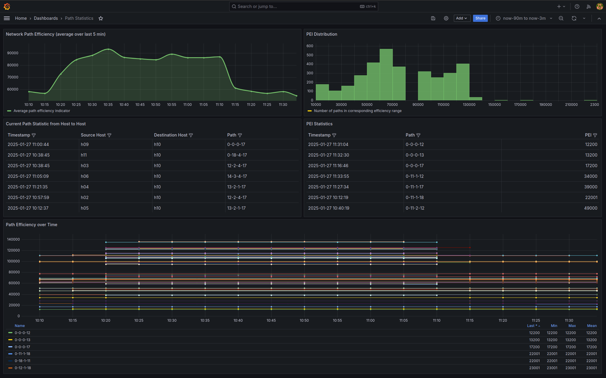

# Optimizer Example Scenario

*Throughout this document the terms path efficiency and path carbon intensity are used interchangably.*

This README is intended to give an overview about the capabilities of the *path optimizer software* component.

Our PoC environment is used as a base to simulate the underlying network infrastructure.
As described in [README.md](../README.md) the IOAM protocol is used for inband network telemetry data collection of sustainability metrics.
The collected data is exported by egress nodes using the IPFIX protocol and stored inside an Influx timeseries database.
This database is accessed by the *path optimizer* to make decisions on how to optimize traffic flow inside a network.

**The goal is to make traffic forwarding carbon aware and to isolate inefficient equipment so that it could be put into an energy saving standby mode during off-peak periods.**

## Topology

The topology depicted in the following subsections is a fictious topology of an internet service provider (ISP).

During the time frame of the experiment neither the carbon intensity of forwarding devices nor of individual links is changed.

During the experiment the following updates to the forwarding tables of the network devices (path updates) are applied in order to be aware of multiple paths between given ingress/egress routers:

1. **Good Routing:** Traffic is sent via "eco"-rated routers.
2. **Bad Routing:** Traffic is sent via paths with higher carbon intensity.
3. **Optimized Routing:** After the optimizer has determined the routes with the lowest carbon intensity from the given set of routes between input and output routers, the traffic is routed via the *optimal* routes in terms of carbon intensity.


### Good Routing

As depicted below with green arrows traffic is sent via "eco"-rated forwarding devices.

Inefficient equipment is avoided.


### Bad Routing

As depicted below with red arrows traffic is sent via forwarding devices with higher carbon intensity.


## Grafana Dashboard

The screenshot below shows the path statistics Grafana dashboard.

Top row:
- The top left diagram shows the average path carbon intensity of all currently used paths in the network
- The top right diagram shows the distribution of path carbon intensity values

Middle row:
- The left table in the middle row shows which path is currently used between which hosts
- The right table in the middle row shows the last collected path carbon intensity value of each path

Bottom row:
- The diagram in the bottom row shows the path carbon intensity of each path over time

In both the top left and the diagram at the bottom one can see that:

- **From 15:50 until 15:55** the good routing configuration was applied
- **From 16:00 until 16:30** the bad routing configuration was applied
- **On 16:35** the optimizer was executed to find the paths with the least carbon intensity which where used at least once in the period from *15:50 to 16:30*
- **The optimizer found and configured the paths with the lowest carbon intensity**




## Experiment

### Deployment of Environment

- In the Makefile set the `RESOURCE FILE` variable to `large_network_good_routing.yaml`
- Start the environment using `make run`
- Wait a couple of minutes for traffic to be sent through the currently configured paths

### Routing Update

- In the Makefile set the `RESOURCE FILE` variable to `bad_network_good_routing.yaml`
- Trigger a configuration update using `make config`
- Wait a couple of minutes for traffic to be sent through the currently configured paths

### Optimize

Due to the configuration updates carbon intensity information could be collected of different network paths.

The optimizer can now be used to identify and configer the most efficient path between every ingress/egress router combination.

To run the optimizer carry out the following steps:

1. Copy the contents of the currently deployed resource file into a temporary file e.g. `large_network_temp.yaml`
2. Run the uv command with the following options:
    - `env-file`: Path to the file containing the environment variabes necessary to connect to InfluxDB
    - `time`: Is by default 600 seconds (10 minutes); as the data of the "good routing" period shall be included time is set 3600 to include all data from (*now-1h*).
    - `resources`: Path to resources file in which the path definitions shall be updated.
    - `verbose`: Displays the path efficiency entries data structure which is used to find the most effienct paths.

```sh
uv run --env-file monitoring/.env optimizer/optimizer.py \
       --time 3600
       --resources config/generator/resources/large_network_temp.yaml
       --verbose
```

#### Path Efficiency Data Structure

The path efficiency data structure is a mapping from ingress router to egress router to a list of path entries.
The list of path entries then contains again a mapping from *IOAM Data Param* to efficiency entry.
The effciency entry is then again a mapping from aggregator to an actual efficiency value.

**The data structure allows instant access to a list of all available paths between an ingress and egress router. Furthermore the data structure can handle the simultaneous collection of multple IOAM data params and aggregators.**

```
# path efficiency data structure legend

ingress-router: {
    egress-router: [
        path-identifier: {
            ioam-data-param: {
                aggregator: {
                    aggregate,
                    time
                }
            }
        }
    ]
}
```

The following excerpt of the path efficiency data structure shows all known paths between router 18 and 11 and router 18 and 12.
Only the values for the IOAM data param 255 where collected.

```
# path efficiency data structure example entry

18: {
    11: [
        {
            (0, 18, 1, 11): {
                255: {
                    <Aggregator.SUM: 1>: {'aggregate': 22001, 'time': '2025-01-24T14:48:33.726243+00:00'},
                    <Aggregator.MIN: 2>: {'aggregate': 301, 'time': '2025-01-24T14:48:33.677158+00:00'},
                    <Aggregator.MAX: 4>: {'aggregate': 11300, 'time': '2025-01-24T14:48:33.764649+00:00'}
                }
            }
        },
        {
            (18, 4, 2, 11): {
                255: {
                    <Aggregator.SUM: 1>: {'aggregate': 58001, 'time': '2025-01-24T15:30:35.830082+00:00'},
                    <Aggregator.MIN: 2>: {'aggregate': 301, 'time': '2025-01-24T15:30:35.770796+00:00'},
                    <Aggregator.MAX: 4>: {'aggregate': 25700, 'time': '2025-01-24T15:30:35.883336+00:00'}
                }
            }
        }
    ],
    12: [
        {
            (0, 18, 1, 12): {
                255: {
                    <Aggregator.SUM: 1>: {'aggregate': 23001, 'time': '2025-01-24T14:53:25.898774+00:00'},
                    <Aggregator.MIN: 2>: {'aggregate': 301, 'time': '2025-01-24T14:53:25.861901+00:00'},
                    <Aggregator.MAX: 4>: {'aggregate': 12300, 'time': '2025-01-24T14:53:25.935990+00:00'}
                }
            }
        },
        {
            (18, 4, 2, 12): {
                255: {
                    <Aggregator.SUM: 1>: {'aggregate': 59001, 'time': '2025-01-24T15:30:27.013745+00:00'},
                    <Aggregator.MIN: 2>: {'aggregate': 301, 'time': '2025-01-24T15:30:26.966696+00:00'},
                    <Aggregator.MAX: 4>: {'aggregate': 25700, 'time': '2025-01-24T15:30:27.054819+00:00'}
                }
            }
        }
    ],
}
```

During the execution of the optimizer application the path lists are sorted by efficiency in descending order so that the most efficient path is the first element of the list.
For the sort algorithm the IOAM data param and aggregator are provided.
These two values could be given to the optimizer as command line arguments.

#### Suggested Path Efficiency Updates

Based on the collected network telemetry data about carbon intensity the optimizer suggests the following improvements.

On the left side of each entry the ingress and egress router are stated.
For each entry the current and new path as well as the relative efficency gain are written to console.

```
s12 -> s11: {'current': (0, 12, 2, 11), 'new': (0, 12, 1, 11), 'relative_efficiency_gain': 0.31}
s12 -> s17: {'current': (12, 2, 4, 17), 'new': (0, 12, 1, 17), 'relative_efficiency_gain': 0.47}
s12 -> s18: {'current': (12, 2, 4, 18), 'new': (0, 12, 1, 18), 'relative_efficiency_gain': 0.61}
s12 -> s15: {'current': (12, 2, 3, 15), 'new': (12, 1, 4, 15), 'relative_efficiency_gain': 0.45}
s12 -> s16: {'current': (12, 2, 3, 16), 'new': (12, 1, 4, 16), 'relative_efficiency_gain': 0.44}
s13 -> s11: {'current': (13, 3, 1, 11), 'new': (0, 13, 2, 11), 'relative_efficiency_gain': 0.48}
s13 -> s14: {'current': (0, 13, 3, 14), 'new': (0, 13, 2, 14), 'relative_efficiency_gain': 0.36}
s13 -> s15: {'current': (13, 2, 3, 15), 'new': (0, 13, 3, 15), 'relative_efficiency_gain': 0.2}
s13 -> s16: {'current': (13, 2, 3, 16), 'new': (0, 13, 3, 16), 'relative_efficiency_gain': 0.2}
s13 -> s17: {'current': (13, 3, 4, 17), 'new': (13, 2, 1, 17), 'relative_efficiency_gain': 0.4}
s13 -> s18: {'current': (13, 3, 4, 18), 'new': (13, 2, 1, 18), 'relative_efficiency_gain': 0.48}
s17 -> s11: {'current': (17, 4, 2, 11), 'new': (0, 17, 1, 11), 'relative_efficiency_gain': 0.48}
s17 -> s12: {'current': (17, 4, 2, 12), 'new': (0, 17, 1, 12), 'relative_efficiency_gain': 0.47}
s17 -> s18: {'current': (0, 17, 4, 18), 'new': (0, 17, 1, 18), 'relative_efficiency_gain': 0.26}
s17 -> s15: {'current': (17, 1, 3, 15), 'new': (0, 17, 4, 15), 'relative_efficiency_gain': 0.45}
s17 -> s16: {'current': (17, 1, 3, 16), 'new': (0, 17, 4, 16), 'relative_efficiency_gain': 0.44}
s17 -> s13: {'current': (17, 4, 3, 13), 'new': (17, 1, 2, 13), 'relative_efficiency_gain': 0.4}
s17 -> s14: {'current': (17, 4, 3, 14), 'new': (17, 1, 2, 14), 'relative_efficiency_gain': 0.37}
s11 -> s12: {'current': (0, 11, 2, 12), 'new': (0, 11, 1, 12), 'relative_efficiency_gain': 0.31}
s11 -> s17: {'current': (11, 2, 4, 17), 'new': (0, 11, 1, 17), 'relative_efficiency_gain': 0.48}
s11 -> s18: {'current': (11, 2, 4, 18), 'new': (0, 11, 1, 18), 'relative_efficiency_gain': 0.62}
s11 -> s13: {'current': (11, 1, 3, 13), 'new': (0, 11, 2, 13), 'relative_efficiency_gain': 0.48}
s11 -> s14: {'current': (11, 1, 3, 14), 'new': (0, 11, 2, 14), 'relative_efficiency_gain': 0.43}
s11 -> s15: {'current': (11, 2, 3, 15), 'new': (11, 1, 4, 15), 'relative_efficiency_gain': 0.45}
s11 -> s16: {'current': (11, 2, 3, 16), 'new': (11, 1, 4, 16), 'relative_efficiency_gain': 0.45}
s14 -> s11: {'current': (14, 3, 1, 11), 'new': (0, 14, 2, 11), 'relative_efficiency_gain': 0.43}
s14 -> s13: {'current': (0, 14, 3, 13), 'new': (0, 14, 2, 13), 'relative_efficiency_gain': 0.36}
s14 -> s15: {'current': (14, 2, 3, 15), 'new': (0, 14, 3, 15), 'relative_efficiency_gain': 0.19}
s14 -> s16: {'current': (14, 2, 3, 16), 'new': (0, 14, 3, 16), 'relative_efficiency_gain': 0.19}
s14 -> s17: {'current': (14, 3, 4, 17), 'new': (14, 2, 1, 17), 'relative_efficiency_gain': 0.37}
s14 -> s18: {'current': (14, 3, 4, 18), 'new': (14, 2, 1, 18), 'relative_efficiency_gain': 0.43}
s15 -> s17: {'current': (15, 3, 4, 17), 'new': (0, 15, 4, 17), 'relative_efficiency_gain': 0.49}
s15 -> s18: {'current': (15, 3, 4, 18), 'new': (0, 15, 4, 18), 'relative_efficiency_gain': 0.57}
s15 -> s11: {'current': (15, 3, 1, 11), 'new': (15, 4, 1, 11), 'relative_efficiency_gain': 0.38}
s15 -> s12: {'current': (15, 3, 2, 12), 'new': (15, 4, 1, 12), 'relative_efficiency_gain': 0.45}
s16 -> s17: {'current': (16, 3, 4, 17), 'new': (0, 16, 4, 17), 'relative_efficiency_gain': 0.49}
s16 -> s18: {'current': (16, 3, 4, 18), 'new': (0, 16, 4, 18), 'relative_efficiency_gain': 0.56}
s16 -> s11: {'current': (16, 3, 1, 11), 'new': (16, 4, 1, 11), 'relative_efficiency_gain': 0.37}
s16 -> s12: {'current': (16, 3, 2, 12), 'new': (16, 4, 1, 12), 'relative_efficiency_gain': 0.44}
s18 -> s11: {'current': (18, 4, 2, 11), 'new': (0, 18, 1, 11), 'relative_efficiency_gain': 0.62}
s18 -> s12: {'current': (18, 4, 2, 12), 'new': (0, 18, 1, 12), 'relative_efficiency_gain': 0.61}
s18 -> s17: {'current': (0, 18, 4, 17), 'new': (0, 18, 1, 17), 'relative_efficiency_gain': 0.26}
s18 -> s15: {'current': (18, 1, 3, 15), 'new': (0, 18, 4, 15), 'relative_efficiency_gain': 0.53}
s18 -> s16: {'current': (18, 1, 3, 16), 'new': (0, 18, 4, 16), 'relative_efficiency_gain': 0.52}
s18 -> s13: {'current': (18, 4, 3, 13), 'new': (18, 1, 2, 13), 'relative_efficiency_gain': 0.48}
s18 -> s14: {'current': (18, 4, 3, 14), 'new': (18, 1, 2, 14), 'relative_efficiency_gain': 0.43}
```

The path efficiency update suggestions where written into the file specified with the `resources` command line argument.
In this case into `config/generator/resources/large_network_temp.yaml`.

#### Apply Optimized Configuration

The optimized configuration needs to be applied using the configuration update utilities available with the `make` utiltiy.

- In the Makefile set the `RESOURCE FILE` variable to `large_network_temp.yaml`
- Trigger a configuration update using `make config`


#### Reachability Test

After the configuration update the carbon intensity of the network will decrease (refer to the Grafana dashbaord).

To make sure that the connectivity via the updated paths is still possible the `pingall` command can be run in mininet.

```
mininet> pingall
*** Ping: testing ping reachability
h01 -> h02 h03 h04 h05 h06 h07 h08 h09 h10 h11 
h02 -> h01 h03 h04 h05 h06 h07 h08 h09 h10 h11 
h03 -> h01 h02 h04 h05 h06 h07 h08 h09 h10 h11 
h04 -> h01 h02 h03 h05 h06 h07 h08 h09 h10 h11 
h05 -> h01 h02 h03 h04 h06 h07 h08 h09 h10 h11 
h06 -> h01 h02 h03 h04 h05 h07 h08 h09 h10 h11 
h07 -> h01 h02 h03 h04 h05 h06 h08 h09 h10 h11 
h08 -> h01 h02 h03 h04 h05 h06 h07 h09 h10 h11 
h09 -> h01 h02 h03 h04 h05 h06 h07 h08 h10 h11 
h10 -> h01 h02 h03 h04 h05 h06 h07 h08 h09 h11 
h11 -> h01 h02 h03 h04 h05 h06 h07 h08 h09 h10 
*** Results: 0% dropped (110/110 received)
```